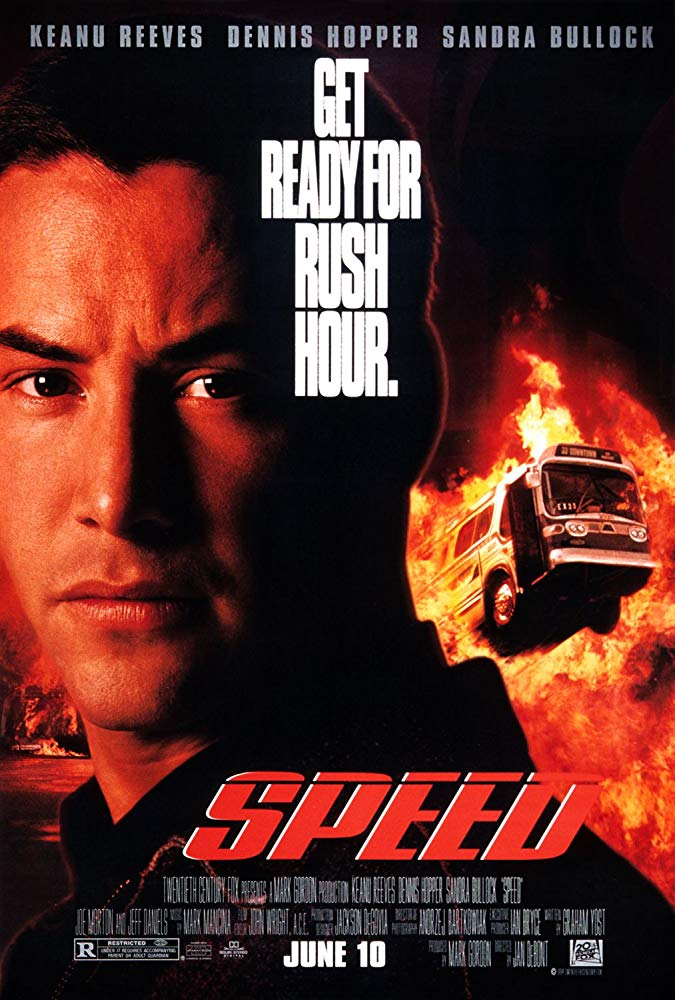
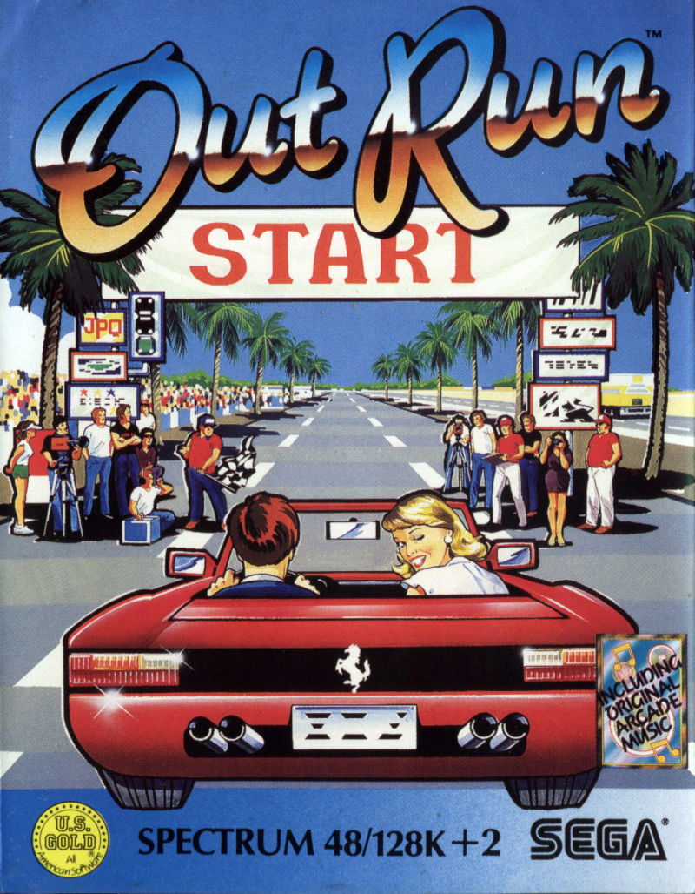
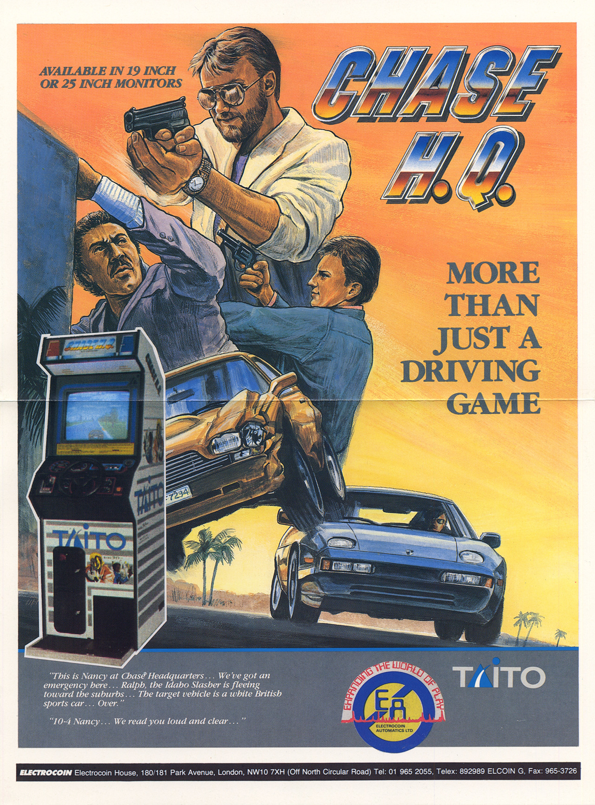
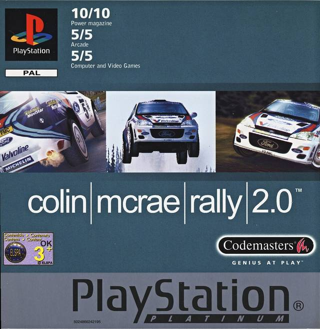
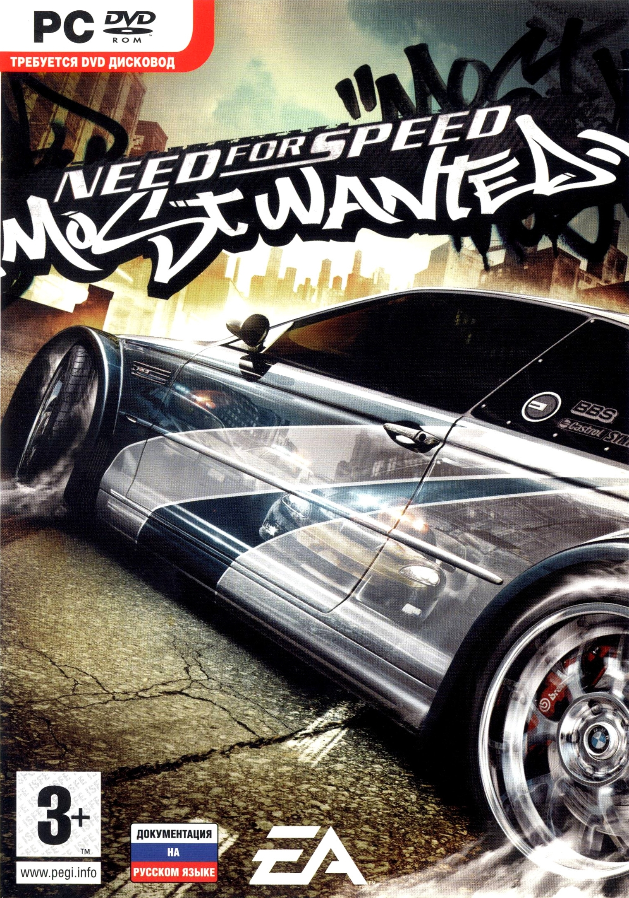

# Self-driving stuff

## Репозитории

### [Self-driving cars utils](https://github.com/Sid1057/self-driving-cars-utils)

Описание:

* Претренированные сети семантической сегментации (CityScapes категории)
* Скрипты для взаимодействия с симулятором CARLA
* Скрипты для конвертации автомобильных форматов датасетов

-----

## Цикл мастер-классов "Как собрать беспилотник за 1.5 часа"

### Глава 0. **Тест-драйв технологий**

*Поверхностный обзор того, как данную задачу решают в различных проектах. Быстрое написание собственного прототипа perception модуля. План дальнейших шагов.*

Мастер-класс 2019.11.02 

[Презентация (RU)](/self-driving/projects/speed/) | [Ноутбук (RU)](https://nbviewer.jupyter.org/urls/sid1057.github.io/self-driving/projects/speed/Sirius.ipynb)

<!-- | [Код проекта]()-->

<!--[Speed game](./projects/speed/)-->

### Глава 1. **Speed**

*Используем модуль распознавания полностью на нейронных сетях, добавляем примитивное планирование, пишем модуль контроля для симулятора CARLA. Ставим цель повторить сюжет фильма скорость, отключаем воздействие на акселератор и управляем рулевым колесом так, чтобы предотвратить аварии.*

*В процессе*

### Глава 2. **Out run**

*Добавляем в модуль распознавания полосу движения, усложняем алгоритм планирования для удержания в полосе и более эффективного обгона. Учимся определять повороты и используем карту/навигатор для достижения финишной черты.*

*В процессе*

### Глава 3. **Chase HQ**

*Добавляем в модуль распознавания детекцию ключевых транспортных средств, оптимизируем работу модуля планирования с целью построения эффективной кривой подъезда и предсказания сложной дорожной обстановки*

*В процессе*

### Глава 4. **Collin mcrae**

*Улучшаем модель распознавания классическими методами компьютерного зрения на основе 3D реконструкции. Повышаем надежность системы в целом. Добавляем распознавание знаков и сигнальных приспособлений.*

*В процессе*

### Глава 5. **F1**

*Добавляем усложненный модуль локализации, строим карту, по которой движется транспортное средство, учимся использовать карту для более эффективного планирования.*

*В процессе*

### Глава 6. **Need for speed: most wanted**

*Добавляем круговой обзор в модуль распознавания, уходим от аварий по вине сторонних участников движения, используем глобальную карту для оптимального выбора скорости.*

*В процессе*

### Глава 7. **GTA**

*Начинаем ездить по правилам.*

*В процессе*
